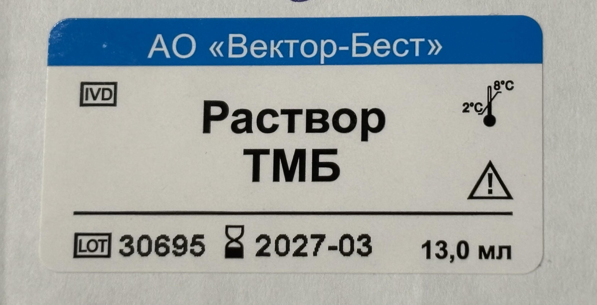
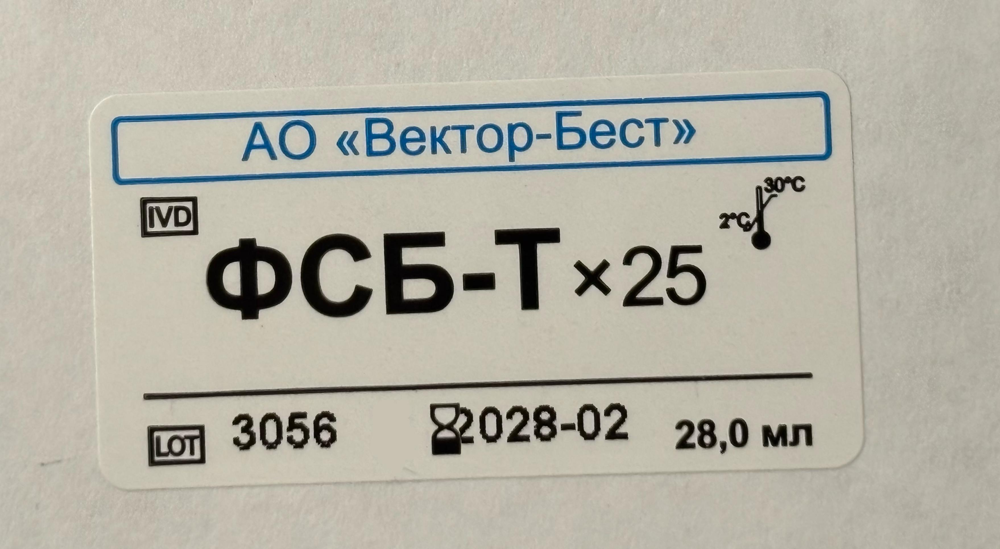

# 🏷️ Классификация этикеток

## 📋 Описание

Данный проект — это комплексное решение для автоматизированной проверки качества этикеток на производстве. Платформа объединяет современные методы компьютерного зрения: детекцию объектов (YOLO), предобработку изображений, а также инструменты для гибкой подготовки и анализа данных, необходимых для построения и внедрения систем контроля качества.

## 🎯 Задача

- **Заказчик:** АО "Вектор-Бест"

Классификация этикеток для маркировки ёмкостей как "хорошие" (печать без дефектов) или "плохие" (имеются дефекты печати), индикация обнаружения брака.

| "Хорошие" этикетки | "Плохие" этикетки |
|:-:|:-:|
|  |  |
|  |  |

### Демонстрация работы

| "Хорошие" этикетки | "Плохие" этикетки |
|:-:|:-:|
|  |  |

### Некоторые из возможных дефектов

- Один символ перекрывает другой
- Тусклая печать, есть прорехи в символах, блёклые цвета
- Отсутствует часть элементов оформления
- Есть грязь на этикетке (следы печати, просто грязные пятна неизвестного происхождения)
- Смазанная/нечёткая печать

## ✨ Основные возможности

- **Классификация этикеток:** автоматическое определение "хороших" и "плохих" этикеток по изображению
- **Детекция объектов:** поиск и выделение ключевых элементов оформления и текста (YOLO)
- **Предобработка изображений:** инверсия, перевод в оттенки серого, подготовка к анализу
- **Анализ признаков:** обучение и анализ моделей на основе геометрических и визуальных признаков
- **Гибкая подготовка датасетов:** поддержка форматов CSV и JSON, автоматическая генерация аннотаций

## 🚀 Установка окружения:

   ```
   conda env create -f resources/conda_env.yaml
   conda activate env_for_vb
   ```

## 📁 Структура проекта

```
project/
├── src/                # Основной исходный код
│   ├── detector/       # Модули детекции объектов
│   ├── image_processor/# Модули предобработки изображений
│   └── pipeline/       # Основные пайплайны обработки
├── stash/              # Рабочие наработки, которые пока отложены
├── utils/              # Вспомогательные скрипты и инструменты
├── data/               # Датасеты и входные файлы
├── resources/          # Веса моделей и конфигурации
└── README.md
```

> Описание работы скриптов и модулей размещается в отдельных README-файлах внутри соответствующих папок.

